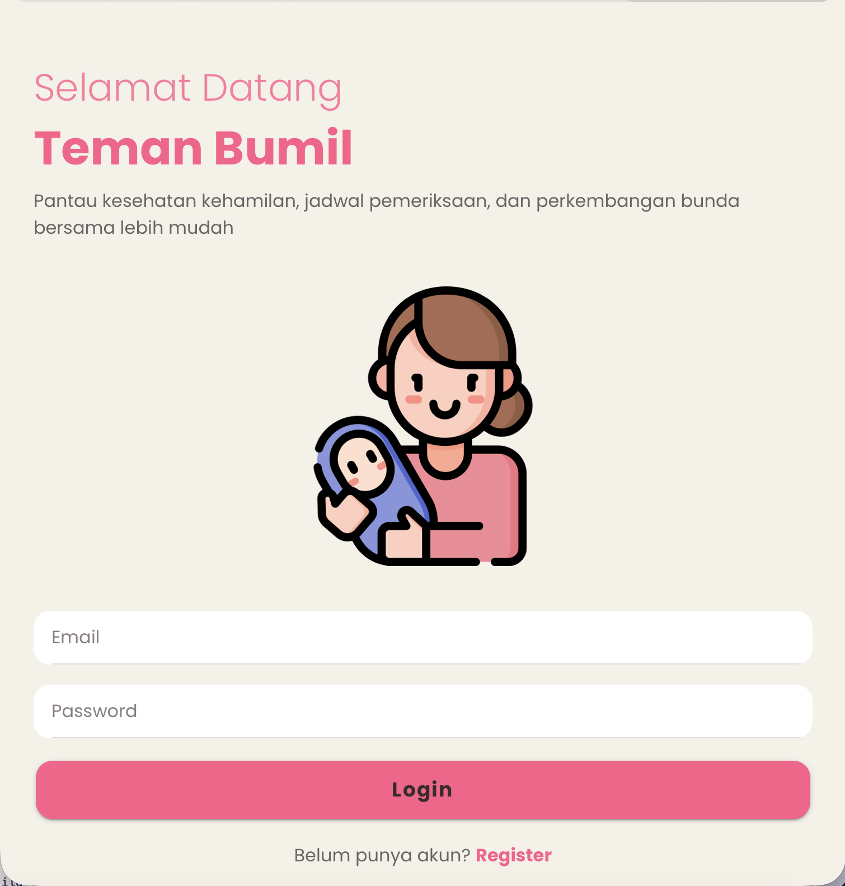
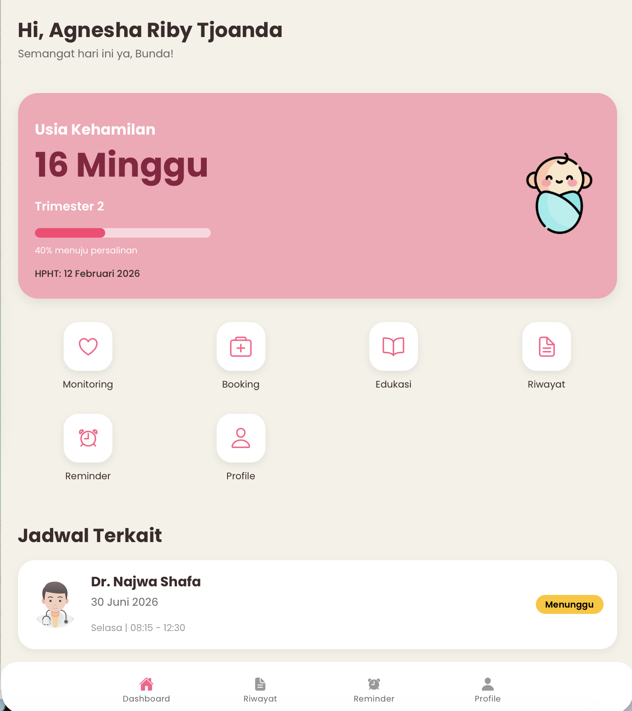
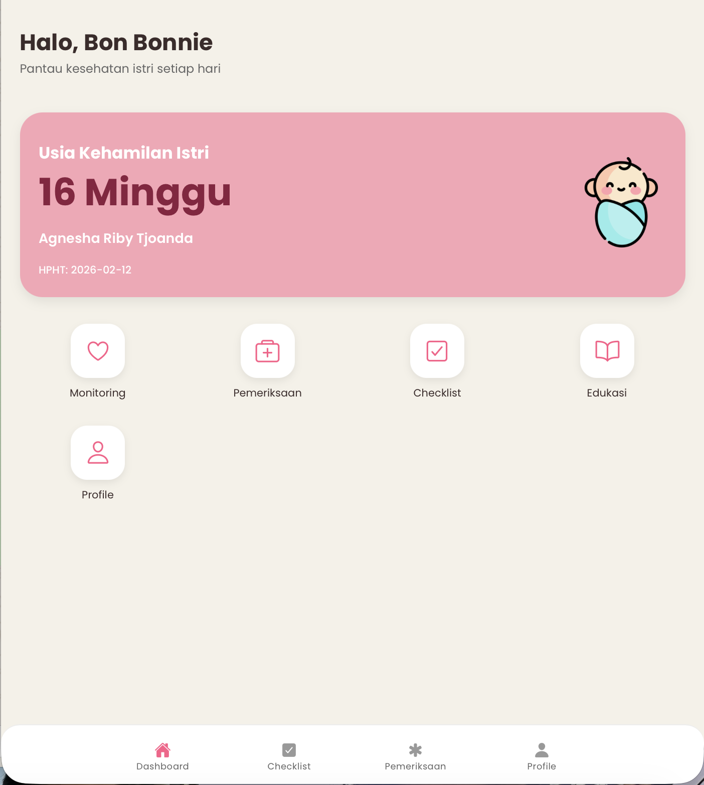
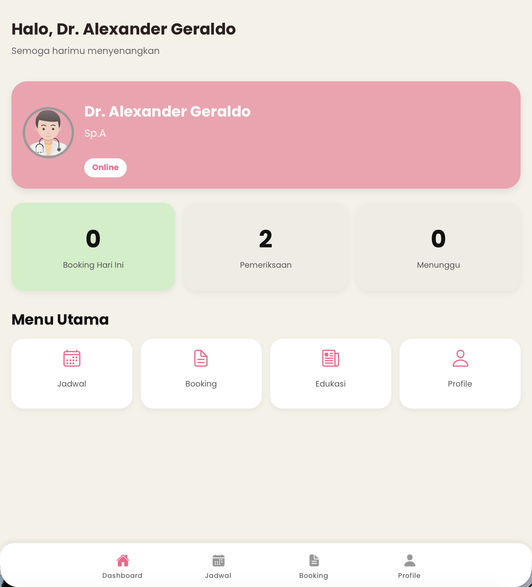
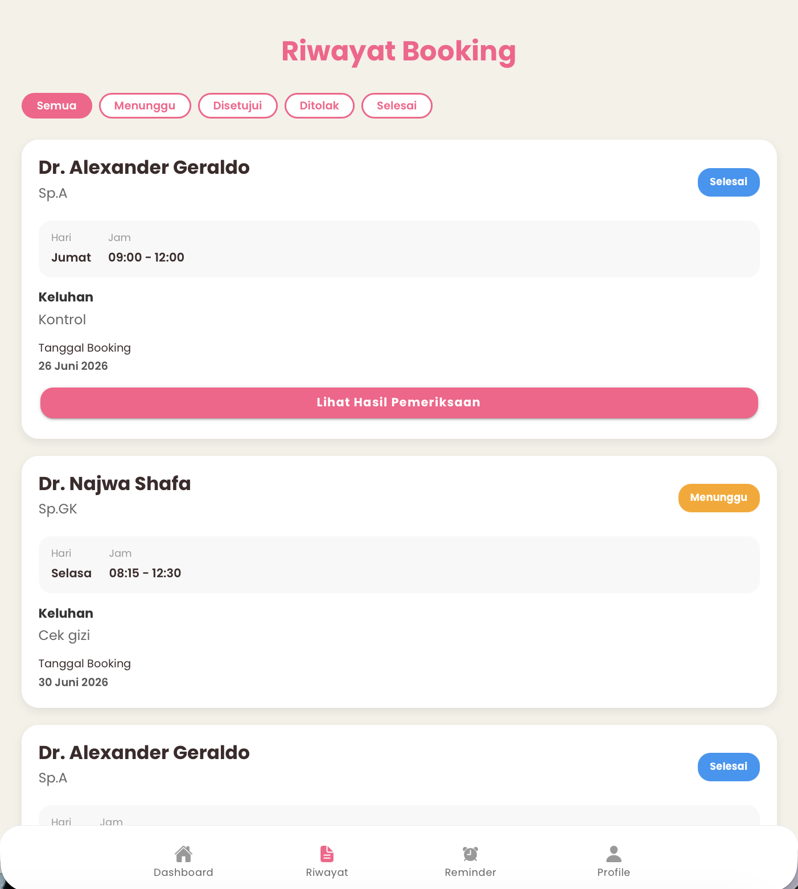
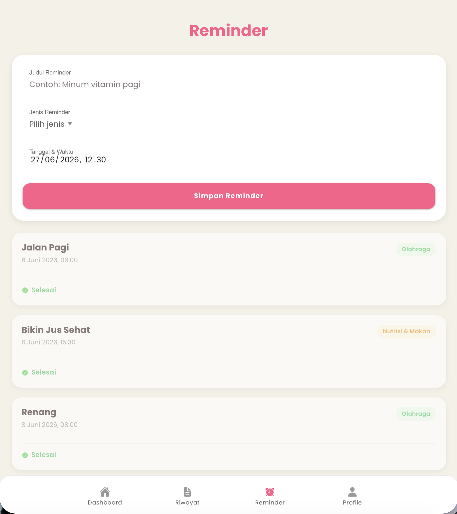
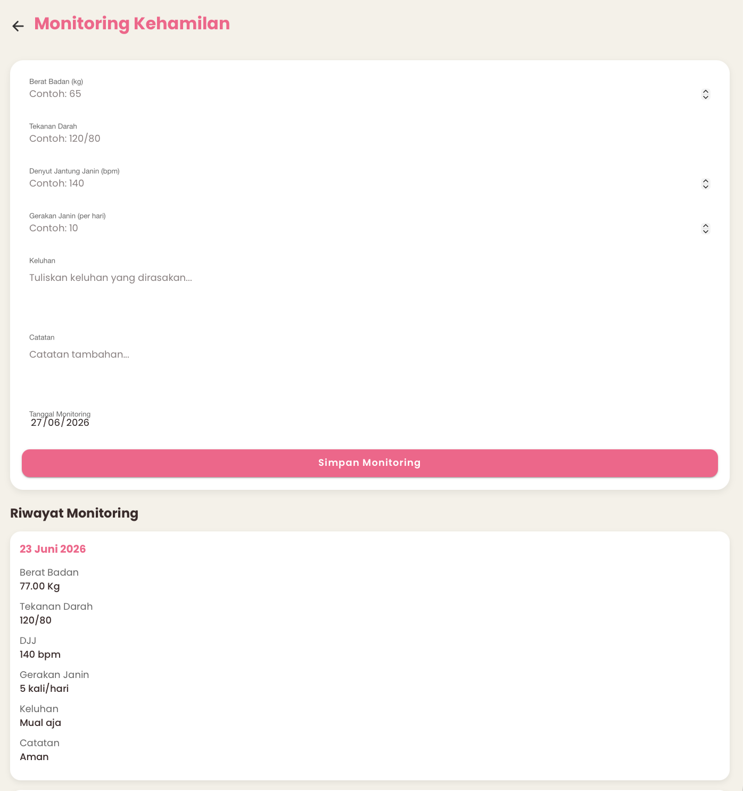
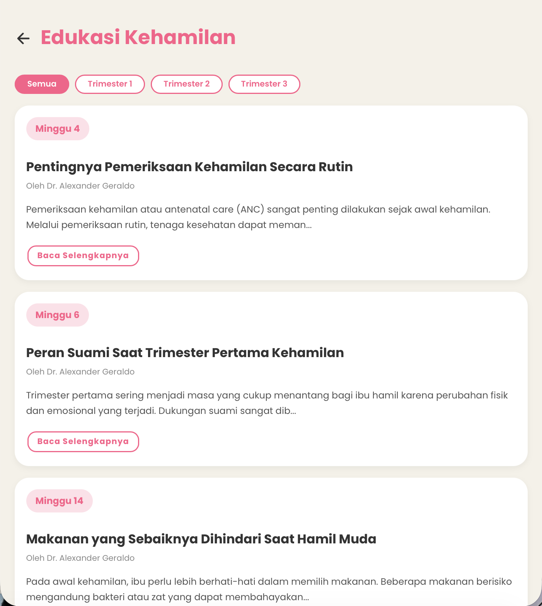
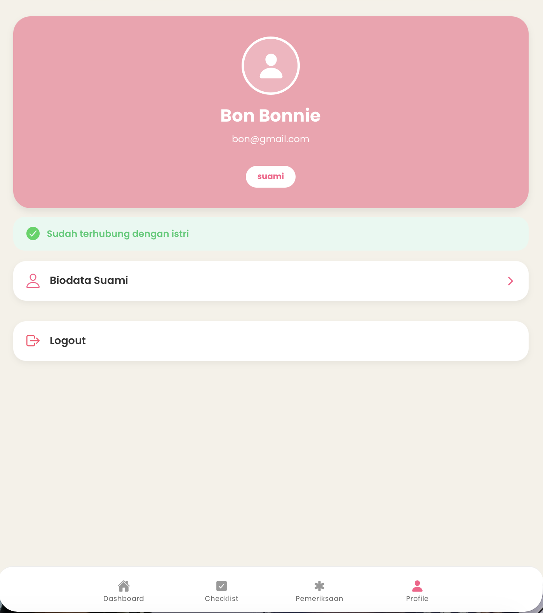

# Sistem Monitoring Ibu Hamil

Sistem Monitoring Ibu Hamil merupakan aplikasi mobile hybrid yang dikembangkan menggunakan **Ionic Framework** dan **Angular**. Aplikasi ini dirancang untuk membantu proses pemantauan kehamilan dengan menyediakan akses bagi ibu hamil, suami, dan dokter melalui sistem berbasis peran (*role-based access*).

## Fitur

- Login dan Registrasi Pengguna
- Dashboard Ibu Hamil
- Dashboard Suami
- Dashboard Dokter
- Monitoring Kehamilan
- Artikel Edukasi Kehamilan
- Hak Akses Berdasarkan Peran Pengguna
- Kelola Profil Pengguna
- Booking Konsultasi Dokter
- Pengingat (Reminder) Aktivitas
- Checklist Pendampingan Suami

## Teknologi yang Digunakan

- Ionic Framework
- Angular
- TypeScript
- Capacitor
- PHP
- MySQL

## Cara Menjalankan Aplikasi

1. Clone repository

```bash
git clone https://github.com/agnesriby-21/monitoring-ibu-hamil.git
```

2. Masuk ke folder project

```bash
cd monitoring-ibu-hamil
```

3. Install seluruh dependency

```bash
npm install
```

4. Jalankan aplikasi

```bash
ionic serve
```

## Struktur Project

```
src/
├── app/
├── assets/
├── environments/
└── theme/
```

### Halaman Login



### Dashboard Ibu Hamil



### Dashboard Suami



### Dashboard Dokter



### Booking Konsultasi Dokter



### Reminder Aktivitas



### Monitoring Kehamilan



### Artikel Edukasi Kehamilan



### Kelola Profil




